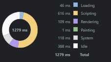

# Overview

This is a basic web application that maps SQL commands to display random tables. A web-based application capable of running SQL queries and displaying the results of said query.
The application is fully responsive and uses advanced react functionalities such as folder management.
The application implements custom css and functionalities such as dropdown.
It uses icons from heroicons [https://heroicons.com/].

# Framework and packages

ReactJs

# Page Load time and it's calculation

The overall Page Load time of the web application is 1279ms.
This performance is measured via the embedded Chrome performance tools

